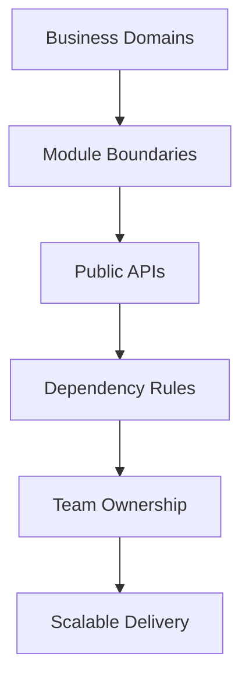

# Day 97 [Expert]: Large-Scale Module Architecture

## Index

- [Goal](#goal)
- [Prerequisites](#prerequisites)
- [Explanation](#explanation)
- [Topic by Topic](#topic-by-topic)
- [Key Concepts](#key-concepts)
- [Visual Concept Map](#visual-concept-map)
- [End-to-End Practical](#end-to-end-practical)
- [Hands-on Coding](#hands-on-coding)
- [Mini Exercise](#mini-exercise)
- [Assessment Quiz](#assessment-quiz)
- [Task](#task)
- [Self Check](#self-check)
- [Interview Questions and Answers](#interview-questions-and-answers)
- [Day 97 Outcome](#day-97-outcome)

## Goal

Design and evolve large-scale frontend module architecture with clear domain boundaries, ownership, and dependency governance.

## Prerequisites

- Day 96 completed
- Strong understanding of feature-based architecture, typed state, and CI quality gates

## Explanation

At large scale, architecture quality determines team velocity. Domain-oriented modules reduce coupling, improve ownership clarity, and enable parallel development.

## Topic by Topic

### Topic 1: Domain-driven Module Boundaries

Theory:
Module boundaries should align with business domains, not file types.

Practical:
Split app by catalog, checkout, billing, and support domains.

Code Example:

```text
features/catalog, features/checkout, features/billing
```

**Explanation:** Domain-driven module boundaries reduce coupling by grouping code around business capabilities instead of file type alone.

**Key Points:**

- Organize modules by domain meaning.
- Keep boundaries visible in the folder structure.
- Reduce accidental cross-feature entanglement.

### Topic 2: Public APIs per Module

Theory:
Each module should expose stable entry points and hide internals.

Practical:
Create `index.ts` exports for module contracts.

Code Example:

```ts
export { CheckoutPage } from "./ui/CheckoutPage";
```

**Explanation:** Public APIs per module keep imports intentional so consumers depend only on stable entry points.

**Key Points:**

- Export only the supported surface area.
- Hide internal implementation details.
- Make refactors safer for consumers.

### Topic 3: Dependency Direction and Anti-corruption

Theory:
One-way dependencies prevent cyclic complexity.

Practical:
Enforce rules: feature can use shared, shared cannot import feature.

Code Example:

```text
feature -> shared allowed; shared -> feature blocked
```

**Explanation:** Dependency direction rules protect architecture by ensuring stable layers are not polluted by feature-specific details.

**Key Points:**

- Keep dependencies flowing in one direction.
- Use anti-corruption layers at risky boundaries.
- Prevent cycles and leakage early.

### Topic 4: Cross-module Communication Patterns

Theory:
Prefer events/contracts over deep cross-imports.

Practical:
Use typed interfaces for inter-module data exchange.

Code Example:

```ts
type CheckoutEvent = { type: "ORDER_PLACED"; orderId: string };
```

**Explanation:** Cross-module communication needs clear patterns so teams do not create hidden coupling through ad hoc sharing.

**Key Points:**

- Choose communication patterns deliberately.
- Avoid bypassing module boundaries casually.
- Keep shared contracts stable and clear.

### Topic 5: Architecture Governance at Scale

Theory:
Large teams need ADRs, ownership maps, and automated lint constraints.

Practical:
Define governance checklist for each new module.

Code Example:

```text
ADR + owner + dependency check + integration tests
```

**Explanation:** Governance at scale matters because large architectures drift quickly without rules, reviews, and shared ownership.

**Key Points:**

- Review architecture continuously.
- Document module standards and exceptions.
- Treat governance as part of delivery, not overhead.

### Topic 6: Portfolio-Level Excellence for Large Scale Module Architecture

Theory:
At expert level, outcomes improve when technical choices are backed by measurable impact, clear communication, and repeatable workflows.

Practical:
Capture one measurable outcome and one improvement plan linked to this topic so your portfolio evidence stays credible.

Code Example:

`jsx
// Track one measurable outcome and one follow-up improvement item.
`
**Explanation:** Portfolio-level architecture excellence means you can explain how module structure supports team scale, feature safety, and long-term change.

**Key Points:**

- Connect structure to maintainability outcomes.
- Show reasoning behind module boundaries.
- Demonstrate architecture as an engineering asset.

## Key Concepts

- Domain-aligned modular decomposition
- Stable module API contracts
- Dependency governance and cycle prevention
- Scalable cross-team collaboration patterns
- Architecture governance discipline

- Evidence-driven engineering

## Visual Concept Map



## End-to-End Practical

1. Select one large feature area.
2. Define domain boundaries and module responsibilities.
3. Create public API contracts per module.
4. Add dependency rules and architecture checks.
5. Document design rationale in ADR format.

## Hands-on Coding

### Example 1: Case - Module Blueprint for Commerce Platform

Scenario:
Commerce app struggles with tangled imports and unclear ownership across teams.

```text
src/
	app/
		providers/
		router/
	features/
		catalog/
			ui/
			model/
			api/
			index.ts
		checkout/
			ui/
			model/
			api/
			index.ts
		billing/
			ui/
			model/
			api/
			index.ts
	shared/
		ui/
		lib/
		config/
```

### Example 2: Case - Public API Contract File

Scenario:
Checkout module should expose only stable entry points to other modules.

```ts
// features/checkout/index.ts
export { CheckoutPage } from "./ui/CheckoutPage";
export { useCheckoutSummary } from "./model/useCheckoutSummary";
export type { CheckoutEvent } from "./model/events";
```

### Example 3: Case - Architecture Rule Definition

Scenario:
Team wants to prevent shared layer from importing feature-specific code.

```text
Rule Set:
- shared cannot import from features
- features cannot import internals of other features (only their index.ts)
- app layer can compose features
```

## Mini Exercise

Scenario:
You are leading architecture for a multi-team project with profile, payments, and analytics modules.

Produce module map, API contracts, and dependency rules; then refactor one area accordingly.

Expected output:

- Clear module ownership boundaries
- Public API surface for each domain
- Reduced coupling and improved team parallelism

## Assessment Quiz

### Quiz Questions

1. Why should module boundaries align with domains?
2. What is the purpose of module public APIs?
3. True or False: Cross-importing internal files across modules improves flexibility.
4. Why enforce one-way dependencies?
5. What keeps architecture healthy over time?

### Quiz Answers

1. It reflects business ownership and scales better with teams
2. To provide stable integration contracts and hide internals
3. False
4. To avoid cycles and uncontrolled coupling
5. Governance: ADRs, ownership, and automated dependency checks

## Task

- Refactor one section into domain-oriented modules
- Add module API contracts and dependency rules
- Complete mini exercise

## Self Check

- You can architect modules for large team scale
- You can enforce robust boundaries with explicit contracts
- You can answer at least 4 out of 5 quiz questions correctly

## Interview Questions and Answers

### Beginner

**Question:** What is a module boundary?

**Answer:** A defined scope of code ownership and responsibility.

**Question:** Why avoid huge shared folders with mixed concerns?

**Answer:** They create coupling and unclear ownership.

### Middle

**Question:** What is a practical rule for cross-module imports?

**Answer:** Import only from module public API files.

**Question:** How do domain boundaries improve team productivity?

**Answer:** Teams can work independently with fewer merge conflicts and regressions.

### Advanced

**Question:** How do you prevent architecture erosion in fast-moving teams?

**Answer:** Add lint rules, ADR reviews, and ownership enforcement in CI.

**Question:** What is a tradeoff of strict module boundaries?

**Answer:** Slight upfront design overhead that pays off with long-term maintainability.

## Day 97 Outcome

- You can design and govern large-scale module architecture
- You can improve scalability with domain contracts and dependency discipline
- You are ready for micro frontend strategy decisions in Day 98
