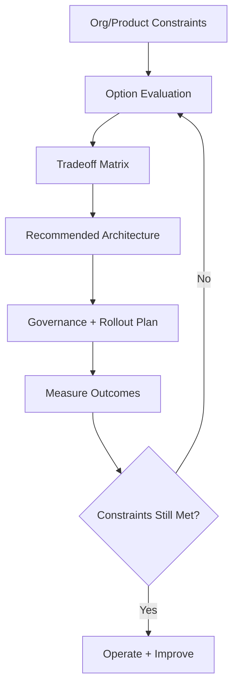

---
title: Micro Frontend Decision Framework
slug: day-098-micro-frontend-decision-framework
dayLabel: Day 98
level: Expert
estimatedMinutes: 30
order: 98
track: react
---
# Day 98 [Expert]: Micro Frontend Decision Framework

## Goal

Build a practical decision framework to choose between monolith, modular monolith, and micro frontend architectures based on business constraints, team topology, deployment independence, runtime complexity, and operational maturity.

## Prerequisites

- Day 97 completed
- Understanding of large-scale module architecture and team ownership models

## Explanation

Micro frontends are powerful but expensive. The right choice depends on team topology, deployment independence needs, and operational maturity. A mature decision should also consider shared dependencies, user experience, observability, security, failure isolation, and the cost of operating multiple independently delivered frontend units.

## Topic by Topic

### Topic 1: Problem-first Decision Making

Theory:
Architecture should solve organizational/product constraints, not follow trends.

Practical:
List pains: team coupling, release bottlenecks, ownership conflicts.

Code Example:

```text
Pain points: shared release train, high merge conflicts, blocked deployments
```

**Explanation:** Micro frontend decisions should start with the problem, not the trend, because they add real architectural cost. A useful architecture record should state the current pain, affected teams, measurable evidence, desired outcome, and why simpler alternatives are insufficient.

**Key Points:**

- Define the business problem first.
- Avoid choosing architecture for hype.
- Use the decision framework to reduce bias.
- Establish measurable signals before introducing architectural complexity.

### Topic 2: Option Spectrum

Theory:
Choices include single SPA, modular monolith, and micro frontend federation.

Practical:
Score each option against requirements.

Code Example:

```text
Option A: monolith
Option B: modular monolith
Option C: micro frontend
```

**Explanation:** There is a spectrum of options, from simple modular monoliths to full micro frontend splits, and not every team needs the far end. Evaluate the simplest architecture that can satisfy the identified constraints before accepting the operational cost of independent frontend deployments.

**Key Points:**

- Consider simpler alternatives first.
- Match the option to team and product scale.
- Treat decomposition as gradual when possible.
- Make the cost of each additional deployment unit explicit.

### Topic 3: Tradeoff Dimensions

Theory:
Compare autonomy, runtime complexity, performance, and governance overhead.

Practical:
Build weighted decision matrix.

Code Example:

```text
Weights: autonomy 30, complexity 25, perf 25, DX 20
```

**Explanation:** Tradeoffs should be examined across delivery speed, autonomy, complexity, performance, and operational overhead. Include shared dependency versioning, failure modes, observability, security, and user experience because a micro frontend can improve team autonomy while making runtime behavior more complex.

**Key Points:**

- Compare benefits and costs side by side.
- Include platform and runtime complexity in decisions.
- Avoid evaluating only team autonomy.
- Validate important assumptions with production or representative measurements.

### Topic 4: Integration Models

Theory:
Micro frontends can be integrated by runtime composition, build-time composition, or routing shells.

Practical:
Choose one integration style and document risk controls.

Code Example:

```text
Shell app + route-based integration for independent domains
```

**Explanation:** Integration models define how independently built pieces come together, which affects performance, tooling, shared dependencies, and runtime risk. Route-based composition can provide stronger isolation, while runtime federation can provide more dynamic composition but requires careful dependency and failure management.

**Key Points:**

- Choose integration style deliberately.
- Consider deployment and shared-dependency impact.
- Keep integration complexity visible.
- Define fallback and failure behavior for unavailable remote applications.

### Topic 5: Governance Requirements

Theory:
Micro frontends require shared standards for design system, observability, and security.

Practical:
Define mandatory cross-team contracts.

Code Example:

```text
Common auth SDK, design tokens, event schema, error telemetry standard
```

**Explanation:** Governance is essential because multiple teams and deployable units can become chaotic without clear standards. Shared contracts should cover authentication, navigation, analytics, accessibility, security, observability, dependency compatibility, and ownership boundaries without forcing every team to release in lockstep.

**Key Points:**

- Define ownership and platform rules clearly.
- Standardize contracts and tooling expectations.
- Balance team autonomy with system consistency.
- Keep cross-team contracts versioned and observable.

### Topic 6: Portfolio-Level Excellence for Micro Frontend Decision Framework

Theory:
At expert level, outcomes improve when technical choices are backed by measurable impact, clear communication, and repeatable workflows.

Practical:
Capture one measurable outcome and one improvement plan linked to this topic so your portfolio evidence stays credible.

Code Example:

```ts
// Track one measurable outcome and one follow-up improvement item.
const microFrontendDecisionOutcome = {
  deploymentCouplingBefore: 8,
  deploymentCouplingAfter: 3,
  architectureReviewDate: "2026-09-01",
};
```

**Explanation:** Portfolio-level excellence here means being able to justify when micro frontends are appropriate and when they are not. Strong evidence should show the original constraint, alternatives considered, decision criteria, rollout strategy, and measurable result rather than simply presenting a distributed architecture as an achievement.

**Key Points:**

- Show decision quality, not just technical ambition.
- Connect architecture to product and team realities.
- Demonstrate disciplined tradeoff thinking.
- Record measurable outcomes and remaining risks.

## Key Concepts

- Architecture decision by constraints
- Option spectrum evaluation
- Tradeoff matrix scoring
- Integration strategy selection
- Governance for distributed frontend teams
- Failure isolation and fallback strategy
- Shared dependency and contract management
- Evidence-driven engineering

## Visual Concept Map



## End-to-End Practical

1. Collect current delivery constraints.
2. Evaluate monolith vs modular monolith vs micro frontend.
3. Score options using weighted matrix.
4. Recommend architecture with rationale.
5. Define phased rollout and governance plan.
6. Document runtime failure and fallback behavior.
7. Define measurable adoption, deployment, performance, or team-autonomy outcomes.

## Hands-on Coding

### Example 1: Case - Decision Matrix Template

Scenario:
A fintech org with 5 frontend teams is debating micro frontend adoption.

```md
| Criterion           | Weight | Monolith | Modular Monolith | Micro Frontend |
| ------------------- | ------ | -------- | ---------------- | -------------- |
| Team autonomy       | 30     | 2        | 4                | 5              |
| Runtime complexity  | 25     | 5        | 4                | 2              |
| Performance risk    | 25     | 4        | 4                | 2              |
| Governance overhead | 20     | 5        | 4                | 2              |
```

**Review point:** Document what the score means and keep the scoring direction consistent. If higher is better, convert cost criteria such as runtime complexity into a benefit-oriented score rather than mixing incompatible scales.

### Example 2: Case - Routing-shell Integration Plan

Scenario:
Enterprise portal chooses domain-level route composition with shared shell app.

```text
Shell routes:
/accounts -> Accounts app
/billing -> Billing app
/support -> Support app

Shared contracts:
auth context, analytics events, UI tokens

Failure policy:
remote unavailable -> route-level fallback/error experience
```

**Review point:** Shared contracts should have explicit ownership and compatibility rules. The shell should not become a hidden monolith by owning every domain's business logic.

### Example 3: Case - No-go Criteria for Micro Frontends

Scenario:
Startup with 1-2 teams and low release contention evaluates micro frontend.

```text
No-go signals:
- Small team count
- Low deployment bottleneck
- Weak platform governance
- No meaningful domain ownership boundary

Decision: modular monolith now, re-evaluate at scale trigger.
```

**Review point:** A no-go decision is a valid architecture outcome. Re-evaluation should be tied to explicit signals such as deployment coupling, team growth, domain ownership conflicts, or sustained release contention.

## Mini Exercise

Scenario:
You are principal engineer for a growing B2B suite with 4 products.

Produce a tradeoff document and recommendation: monolith, modular monolith, or micro frontend, with migration triggers.

Expected output:

- Weighted decision table
- Final recommendation with clear rationale
- Risk and governance checklist
- Rollout and fallback strategy
- At least one measurable decision criterion

## Assessment Quiz

### Quiz Questions

1. What is the biggest mistake in micro frontend adoption?
2. Why use a weighted decision matrix?
3. True or False: Micro frontends always improve performance.
4. Name one governance requirement for distributed frontends.
5. What is a valid reason to defer micro frontend adoption?
6. Why should failure and fallback behavior be part of the architecture decision?
7. What is one important cost of independently deployed frontend applications?
8. When is a modular monolith often a better choice than micro frontends?

### Quiz Answers

1. Choosing architecture by hype instead of constraints
2. It makes tradeoffs explicit and comparable
3. False
4. Shared auth/telemetry/design-system standards
5. Small team scale with low release bottleneck
6. Distributed runtime dependencies can fail independently, so user experience and recovery behavior must be designed intentionally.
7. Additional operational, deployment, dependency, observability, and governance complexity.
8. When domain boundaries and team autonomy can be achieved without the operational cost of multiple independently deployed frontend units.

## Task

- Produce monolith vs micro-frontend tradeoff document
- Include recommendation, risk, and rollout triggers
- Define failure/fallback behavior for one integration model
- Include one measurable decision criterion
- Complete mini exercise

## Self Check

- You can evaluate frontend architecture choices with senior-level reasoning
- You can justify micro frontend decisions with explicit tradeoffs
- You can identify when a modular monolith is the better option
- You can answer at least 6 out of 8 quiz questions correctly

## Interview Questions and Answers

### Beginner

**Question:** What is a micro frontend?

**Answer:** A frontend architecture where independent teams deliver separate UI modules/apps.

**Question:** Is micro frontend required for every project?

**Answer:** No, it depends on team and product constraints.

### Middle

**Question:** What are two costs of micro frontend architecture?

**Answer:** Higher runtime complexity and stronger governance requirements.

**Question:** What is a common alternative before full micro frontend?

**Answer:** Modular monolith with strict domain boundaries.

### Advanced

**Question:** How do you define migration triggers for micro frontend adoption?

**Answer:** Use measurable signals like deployment coupling, team concurrency pain, and ownership conflicts.

**Question:** What architecture anti-pattern harms distributed frontends most?

**Answer:** Independent teams without shared platform standards for auth, design, telemetry, and routing.

**Question:** How should shared dependencies be handled across independently deployed frontends?

**Answer:** Establish explicit compatibility policies, versioning rules, ownership, and testing for the supported dependency combinations. Do not assume shared dependencies are automatically safe simply because the applications use the same library version.

**Question:** How would you decide between a modular monolith and micro frontends for a large organization?

**Answer:** Evaluate team boundaries, deployment coupling, domain ownership, operational maturity, runtime performance, security, observability, and the cost of independent deployments. Choose micro frontends only when their autonomy benefits justify the additional system complexity.

## Day 98 Outcome

- You can decide micro frontend adoption using a rigorous framework
- You can balance autonomy with complexity and governance realities
- You can define rollout, failure, and fallback strategies for distributed frontends
- You are ready for senior interview simulation in Day 99
