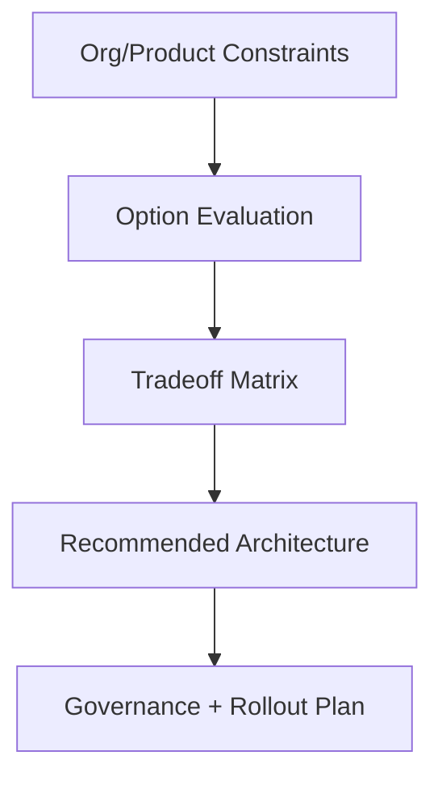

# Day 98 [Expert]: Micro Frontend Decision Framework

## Index

- [Goal](#goal)
- [Prerequisites](#prerequisites)
- [Explanation](#explanation)
- [Topic by Topic](#topic-by-topic)
- [Key Concepts](#key-concepts)
- [Visual Concept Map](#visual-concept-map)
- [End-to-End Practical](#end-to-end-practical)
- [Hands-on Coding](#hands-on-coding)
- [Mini Exercise](#mini-exercise)
- [Assessment Quiz](#assessment-quiz)
- [Task](#task)
- [Self Check](#self-check)
- [Interview Questions and Answers](#interview-questions-and-answers)
- [Day 98 Outcome](#day-98-outcome)

## Goal

Build a practical decision framework to choose between monolith, modular monolith, and micro frontend architectures.

## Prerequisites

- Day 97 completed
- Understanding of large-scale module architecture and team ownership models

## Explanation

Micro frontends are powerful but expensive. The right choice depends on team topology, deployment independence needs, and operational maturity.

## Topic by Topic

### Topic 1: Problem-first Decision Making

Theory:
Architecture should solve organizational/product constraints, not follow trends.

Practical:
List pains: team coupling, release bottlenecks, ownership conflicts.

Code Example:

```text
Pain points: shared release train, high merge conflicts, blocked deployments
```

**Explanation:** Micro frontend decisions should start with the problem, not the trend, because they add real architectural cost.

**Key Points:**

- Define the business problem first.
- Avoid choosing architecture for hype.
- Use the decision framework to reduce bias.

### Topic 2: Option Spectrum

Theory:
Choices include single SPA, modular monolith, and micro frontend federation.

Practical:
Score each option against requirements.

Code Example:

```text
Option A: monolith
Option B: modular monolith
Option C: micro frontend
```

**Explanation:** There is a spectrum of options, from simple modular monoliths to full micro frontend splits, and not every team needs the far end.

**Key Points:**

- Consider simpler alternatives first.
- Match the option to team and product scale.
- Treat decomposition as gradual when possible.

### Topic 3: Tradeoff Dimensions

Theory:
Compare autonomy, runtime complexity, performance, and governance overhead.

Practical:
Build weighted decision matrix.

Code Example:

```text
Weights: autonomy 30, complexity 25, perf 25, DX 20
```

**Explanation:** Tradeoffs should be examined across delivery speed, autonomy, complexity, performance, and operational overhead.

**Key Points:**

- Compare benefits and costs side by side.
- Include platform and runtime complexity in decisions.
- Avoid evaluating only team autonomy.

### Topic 4: Integration Models

Theory:
Micro frontends can be integrated by runtime composition, build-time composition, or routing shells.

Practical:
Choose one integration style and document risk controls.

Code Example:

```text
Shell app + route-based integration for independent domains
```

**Explanation:** Integration models define how independently built pieces come together, which affects performance, tooling, and runtime risk.

**Key Points:**

- Choose integration style deliberately.
- Consider deployment and shared-dependency impact.
- Keep integration complexity visible.

### Topic 5: Governance Requirements

Theory:
Micro frontends require shared standards for design system, observability, and security.

Practical:
Define mandatory cross-team contracts.

Code Example:

```text
Common auth SDK, design tokens, event schema, error telemetry standard
```

**Explanation:** Governance is essential because multiple teams and deployable units can become chaotic without clear standards.

**Key Points:**

- Define ownership and platform rules clearly.
- Standardize contracts and tooling expectations.
- Balance team autonomy with system consistency.

### Topic 6: Portfolio-Level Excellence for Micro Frontend Decision Framework

Theory:
At expert level, outcomes improve when technical choices are backed by measurable impact, clear communication, and repeatable workflows.

Practical:
Capture one measurable outcome and one improvement plan linked to this topic so your portfolio evidence stays credible.

Code Example:

`jsx
// Track one measurable outcome and one follow-up improvement item.
`
**Explanation:** Portfolio-level excellence here means being able to justify when micro frontends are appropriate and when they are not.

**Key Points:**

- Show decision quality, not just technical ambition.
- Connect architecture to product and team realities.
- Demonstrate disciplined tradeoff thinking.

## Key Concepts

- Architecture decision by constraints
- Option spectrum evaluation
- Tradeoff matrix scoring
- Integration strategy selection
- Governance for distributed frontend teams

- Evidence-driven engineering

## Visual Concept Map



## End-to-End Practical

1. Collect current delivery constraints.
2. Evaluate monolith vs modular monolith vs micro frontend.
3. Score options using weighted matrix.
4. Recommend architecture with rationale.
5. Define phased rollout and governance plan.

## Hands-on Coding

### Example 1: Case - Decision Matrix Template

Scenario:
A fintech org with 5 frontend teams is debating micro frontend adoption.

```md
| Criterion           | Weight | Monolith | Modular Monolith | Micro Frontend |
| ------------------- | ------ | -------- | ---------------- | -------------- |
| Team autonomy       | 30     | 2        | 4                | 5              |
| Runtime complexity  | 25     | 5        | 4                | 2              |
| Performance risk    | 25     | 4        | 4                | 2              |
| Governance overhead | 20     | 5        | 4                | 2              |
```

### Example 2: Case - Routing-shell Integration Plan

Scenario:
Enterprise portal chooses domain-level route composition with shared shell app.

```text
Shell routes:
/accounts -> Accounts app
/billing -> Billing app
/support -> Support app

Shared contracts:
auth context, analytics events, UI tokens
```

### Example 3: Case - No-go Criteria for Micro Frontends

Scenario:
Startup with 1-2 teams and low release contention evaluates micro frontend.

```text
No-go signals:
- Small team count
- Low deployment bottleneck
- Weak platform governance

Decision: modular monolith now, re-evaluate at scale trigger.
```

## Mini Exercise

Scenario:
You are principal engineer for a growing B2B suite with 4 products.

Produce a tradeoff document and recommendation: monolith, modular monolith, or micro frontend, with migration triggers.

Expected output:

- Weighted decision table
- Final recommendation with clear rationale
- Risk and governance checklist

## Assessment Quiz

### Quiz Questions

1. What is the biggest mistake in micro frontend adoption?
2. Why use a weighted decision matrix?
3. True or False: Micro frontends always improve performance.
4. Name one governance requirement for distributed frontends.
5. What is a valid reason to defer micro frontend adoption?

### Quiz Answers

1. Choosing architecture by hype instead of constraints
2. It makes tradeoffs explicit and comparable
3. False
4. Shared auth/telemetry/design-system standards
5. Small team scale with low release bottleneck

## Task

- Produce monolith vs micro-frontend tradeoff document
- Include recommendation, risk, and rollout triggers
- Complete mini exercise

## Self Check

- You can evaluate frontend architecture choices with senior-level reasoning
- You can justify micro frontend decisions with explicit tradeoffs
- You can answer at least 4 out of 5 quiz questions correctly

## Interview Questions and Answers

### Beginner

**Question:** What is a micro frontend?

**Answer:** A frontend architecture where independent teams deliver separate UI modules/apps.

**Question:** Is micro frontend required for every project?

**Answer:** No, it depends on team and product constraints.

### Middle

**Question:** What are two costs of micro frontend architecture?

**Answer:** Higher runtime complexity and stronger governance requirements.

**Question:** What is a common alternative before full micro frontend?

**Answer:** Modular monolith with strict domain boundaries.

### Advanced

**Question:** How do you define migration triggers for micro frontend adoption?

**Answer:** Use measurable signals like deployment coupling, team concurrency pain, and ownership conflicts.

**Question:** What architecture anti-pattern harms distributed frontends most?

**Answer:** Independent teams without shared platform standards for auth, design, telemetry, and routing.

## Day 98 Outcome

- You can decide micro frontend adoption using a rigorous framework
- You can balance autonomy with complexity and governance realities
- You are ready for senior interview simulation in Day 99
