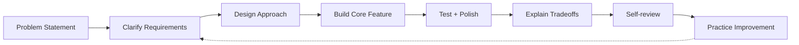

---
title: Senior Machine Coding Simulation
slug: day-099-senior-machine-coding-simulation
dayLabel: Day 99
level: Expert
estimatedMinutes: 45
order: 99
track: react
---
# Day 99 [Expert]: Senior Machine Coding Simulation

## Goal

Simulate senior machine-coding interviews by combining implementation speed, architectural clarity, requirement analysis, testing, accessibility, resilience, and tradeoff communication.

## Prerequisites

- Day 98 completed
- Strong React architecture, testing, performance, and security fundamentals

## Explanation

Senior machine coding is not only writing code quickly. It is about requirement clarification, solution design, execution under time, technical communication, validation, and deliberate prioritization. A strong solution should have a stable core flow before optional polish is attempted.

## Topic by Topic

### Topic 1: Interview Problem Framing

Theory:
Clarifying requirements upfront prevents wrong solution direction.

Practical:
Ask for constraints, expected scale, and non-functional priorities.

Code Example:

```text
Clarify: users, data size, latency tolerance, offline needs, accessibility constraints
```

**Explanation:** Senior-level machine coding starts with framing the problem clearly so the implementation follows the right priorities. Confirm ambiguous requirements, identify assumptions, and distinguish must-have behavior from optional enhancements.

**Key Points:**

- Clarify requirements before coding.
- Identify core flows and constraints quickly.
- Show structured thinking from the start.
- State assumptions explicitly when requirements are incomplete.

### Topic 2: Time-boxed Implementation Strategy

Theory:
Split 2-hour challenge into design, core implementation, polish, and validation.

Practical:
Follow 10/20/70/20 minute style segments.

Code Example:

```text
10m requirements + 20m architecture + 70m build + 20m tests/polish
```

**Explanation:** Time-boxing matters because strong candidates prioritize a solid core solution before optional polish. Keep a visible stopping point for each phase and re-scope early if implementation starts consuming the validation window.

**Key Points:**

- Plan the implementation in stages.
- Deliver the most important value first.
- Leave time for review and fixes.
- Keep a clear MVP boundary.

### Topic 3: Communicating Tradeoffs

Theory:
Interviewers evaluate decision quality, not only final UI.

Practical:
Explain why you chose state, routing, and data strategy.

Code Example:

```text
Chose TanStack Query for server cache + optimistic UX with rollback
```

**Explanation:** Communicating tradeoffs is part of the interview signal because senior candidates explain why they chose one path over another. Mention alternatives briefly and connect the chosen approach to the actual constraint.

**Key Points:**

- State tradeoffs while coding, not only after.
- Show awareness of alternatives.
- Connect choices to constraints and impact.
- Avoid over-engineering when the requirement does not justify it.

### Topic 4: Senior-level Quality Signals

Theory:
Show accessibility, error handling, testability, and maintainable architecture.

Practical:
Include at least one test and one resilience behavior.

Code Example:

```text
Add loading/error/empty states and one RTL interaction test
```

**Explanation:** Quality signals at senior level include structure, clarity, correctness, testing sense, and production-minded decisions. A concise but deliberate validation strategy is stronger than adding many incomplete tests at the end.

**Key Points:**

- Write readable, organized code.
- Show validation and edge-case awareness.
- Reflect production standards even under time pressure.
- Prioritize critical user and failure paths.

### Topic 5: Self-review and Improvement Loop

Theory:
Post-simulation analysis accelerates growth.

Practical:
Score implementation on correctness, structure, communication, and edge cases.

Code Example:

```text
Rubric: clarity, architecture, reliability, performance, communication
```

**Explanation:** Self-review is critical because many strong interview improvements come from catching your own mistakes before the interviewer does. Review both what worked and what you consciously left incomplete because of time constraints.

**Key Points:**

- Reserve time to inspect your own solution.
- Fix obvious bugs and unclear naming.
- Mention known gaps honestly if time runs out.
- Convert recurring gaps into focused practice items.

### Topic 6: Portfolio-Level Excellence for Senior Machine Coding Simulation

Theory:
At expert level, outcomes improve when technical choices are backed by measurable impact, clear communication, and repeatable workflows.

Practical:
Capture one measurable outcome and one improvement plan linked to this topic so your portfolio evidence stays credible.

Code Example:

```ts
// Track one measurable outcome and one follow-up improvement item.
const simulationOutcome = {
  requirementsClarifiedBeforeCoding: true,
  coreFlowCompleted: true,
  selfReviewScore: 8,
  nextPracticeArea: "integration testing",
};
```

**Explanation:** Portfolio-level excellence in machine coding means your solution process itself demonstrates senior engineering judgment, not just a working UI. Strong evidence describes the prompt, constraints, decisions, result, and remaining gaps without exposing confidential interview or company information.

**Key Points:**

- Showcase the way you think, not only the output.
- Connect coding decisions to engineering maturity.
- Treat the simulation like a real delivery exercise.
- Capture measurable learning outcomes.

## Key Concepts

- Requirement clarification discipline
- Time-boxed coding workflow
- MVP prioritization
- Tradeoff articulation
- Senior quality indicators
- Reflective improvement loop
- Evidence-driven engineering

## Visual Concept Map



## End-to-End Practical

1. Pick one machine-coding prompt.
2. Write quick architecture plan and time-box.
3. Identify MVP and explicit non-goals.
4. Implement MVP with core feature flow.
5. Add quality layers (errors, accessibility, tests).
6. Validate critical paths and edge cases.
7. Present tradeoffs and self-review gaps.

## Hands-on Coding

### Example 1: Case - Prompt Breakdown Template

Scenario:
Prompt: Build task board with filters, drag-drop simulation, and persistent state.

```text
Breakdown:
- Must-have: create/move/filter tasks
- Nice-to-have: persistence + keyboard access
- Time-box: MVP first, polish second
```

**Review point:** Before implementation, identify the minimum data model, component boundaries, state ownership, and failure assumptions. If persistence is optional, do not let it block the core task-board workflow.

### Example 2: Case - Senior Communication Snippet

Scenario:
You chose `useReducer` for complex local transitions instead of Redux in interview.

```text
Reasoning:
- Scope is single feature module
- High transition complexity, low cross-feature sharing
- useReducer keeps explicit action model without global-store overhead
```

**Review point:** A senior explanation should also mention the alternative considered and the condition that would justify changing the decision later.

### Example 3: Case - Self-review Rubric Output

Scenario:
After simulation, candidate prepares improvement notes.

```md
## Self-review

- Correctness: 8/10
- Architecture: 7/10
- Edge-case handling: 6/10
- Test coverage: 5/10
- Communication clarity: 8/10

Next Focus:

1. Add async failure retries
2. Improve keyboard accessibility coverage
3. Add one integration-style test
```

**Review point:** Focus the next practice session on the lowest-impact gap first, and distinguish a missing feature caused by prioritization from a defect in the completed core flow.

## Mini Exercise

Scenario:
Run a full 2-hour simulation for a "Kanban + search + optimistic save" challenge.

Deliver code, architecture explanation, and self-review document.

Expected output:

- Functional MVP within time-box
- Clear technical tradeoff explanation
- At least one meaningful validation test
- Honest self-assessment with actionable next steps

## Assessment Quiz

### Quiz Questions

1. Why is requirement clarification crucial in machine coding?
2. What makes a senior-level answer different from junior-level implementation?
3. True or False: Feature completion matters more than communication quality.
4. What are essential quality signals in coding interviews?
5. Why conduct post-interview self-review?
6. Why should an MVP boundary be defined before implementation?
7. What should you do when an optional feature threatens the validation window?
8. Why is it useful to explain alternatives when presenting an architecture decision?

### Quiz Answers

1. It reduces rework and aligns the solution with evaluator expectations and constraints.
2. Strong tradeoff reasoning, architecture quality, resilience thinking, and clear communication.
3. False.
4. Correctness, maintainability, testability, accessibility, and failure handling.
5. To identify gaps and systematically improve future performance.
6. It protects the core delivery path and prevents optional work from consuming the whole time-box.
7. Defer or re-scope it and protect the stable core flow plus validation.
8. It demonstrates that the decision was intentional and constraint-driven rather than accidental.

## Task

- Complete one 2-hour challenge and self-review.
- Explain design choices and tradeoffs explicitly.
- Include at least one meaningful validation test.
- Record one recurring improvement area.
- Complete mini exercise.

## Self Check

- You can execute senior-style machine coding with structure.
- You can protect MVP scope under time pressure.
- You can communicate technical decisions and tradeoffs.
- You can identify quality and resilience gaps.
- You can answer at least 6 out of 8 quiz questions correctly.

## Interview Questions and Answers

### Beginner

**Question:** What is machine coding round?

**Answer:** A practical coding interview where you build a feature under time constraints.

**Question:** Why is planning important before coding?

**Answer:** It avoids wasted effort and guides implementation priorities.

### Middle

**Question:** How do you prioritize features in a 2-hour challenge?

**Answer:** Deliver the core user flow first, then add robustness, tests, and polish according to the remaining time.

**Question:** What should you verbalize during implementation?

**Answer:** Assumptions, tradeoffs, constraints, and reasons for architectural choices.

### Advanced

**Question:** What separates senior candidates in machine coding?

**Answer:** They balance delivery speed with architecture clarity, reliability, accessibility, testing, and communication.

**Question:** How do you recover if implementation gets stuck mid-interview?

**Answer:** Re-scope to the core path, explain the tradeoff, isolate the blocker, and complete a stable MVP with an explicit backlog.

**Question:** How do you decide what not to build during a time-boxed challenge?

**Answer:** Protect requirements that are essential to the primary user journey and defer enhancements whose absence does not invalidate the core solution.

**Question:** How would you evaluate your own solution after the interview?

**Answer:** Review correctness, architecture, accessibility, failure handling, testability, performance, communication, and the tradeoffs made under the time constraint. Convert recurring gaps into focused practice goals.

## Day 99 Outcome

- You can perform senior-level machine coding simulations end-to-end
- You can prioritize an MVP and validate critical paths under interview pressure
- You can articulate tradeoffs and architecture clearly
- You can turn self-review findings into a repeatable improvement plan
