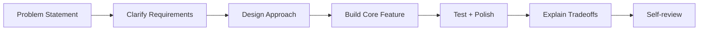

# Day 99 [Expert]: Senior Machine Coding Simulation

## Index

- [Goal](#goal)
- [Prerequisites](#prerequisites)
- [Explanation](#explanation)
- [Topic by Topic](#topic-by-topic)
- [Key Concepts](#key-concepts)
- [Visual Concept Map](#visual-concept-map)
- [End-to-End Practical](#end-to-end-practical)
- [Hands-on Coding](#hands-on-coding)
- [Mini Exercise](#mini-exercise)
- [Assessment Quiz](#assessment-quiz)
- [Task](#task)
- [Self Check](#self-check)
- [Interview Questions and Answers](#interview-questions-and-answers)
- [Day 99 Outcome](#day-99-outcome)

## Goal

Simulate senior machine-coding interviews by combining implementation speed, architectural clarity, and tradeoff communication.

## Prerequisites

- Day 98 completed
- Strong React architecture, testing, performance, and security fundamentals

## Explanation

Senior machine coding is not only writing code quickly. It is about requirement clarification, solution design, execution under time, and technical communication.

## Topic by Topic

### Topic 1: Interview Problem Framing

Theory:
Clarifying requirements upfront prevents wrong solution direction.

Practical:
Ask for constraints, expected scale, and non-functional priorities.

Code Example:

```text
Clarify: users, data size, latency tolerance, offline needs, accessibility constraints
```

**Explanation:** Senior-level machine coding starts with framing the problem clearly so the implementation follows the right priorities.

**Key Points:**

- Clarify requirements before coding.
- Identify core flows and constraints quickly.
- Show structured thinking from the start.

### Topic 2: Time-boxed Implementation Strategy

Theory:
Split 2-hour challenge into design, core implementation, polish, and validation.

Practical:
Follow 20/70/20/10 minute style segments.

Code Example:

```text
10m requirements + 20m architecture + 70m build + 20m tests/polish
```

**Explanation:** Time-boxing matters because strong candidates prioritize a solid core solution before optional polish.

**Key Points:**

- Plan the implementation in stages.
- Deliver the most important value first.
- Leave time for review and fixes.

### Topic 3: Communicating Tradeoffs

Theory:
Interviewers evaluate decision quality, not only final UI.

Practical:
Explain why you chose state, routing, and data strategy.

Code Example:

```text
Chose TanStack Query for server cache + optimistic UX with rollback
```

**Explanation:** Communicating tradeoffs is part of the interview signal because senior candidates explain why they chose one path over another.

**Key Points:**

- State tradeoffs while coding, not only after.
- Show awareness of alternatives.
- Connect choices to constraints and impact.

### Topic 4: Senior-level Quality Signals

Theory:
Show accessibility, error handling, testability, and maintainable architecture.

Practical:
Include at least one test and one resilience behavior.

Code Example:

```text
Add loading/error/empty states and one RTL interaction test
```

**Explanation:** Quality signals at senior level include structure, clarity, correctness, testing sense, and production-minded decisions.

**Key Points:**

- Write readable, organized code.
- Show validation and edge-case awareness.
- Reflect production standards even under time pressure.

### Topic 5: Self-review and Improvement Loop

Theory:
Post-simulation analysis accelerates growth.

Practical:
Score implementation on correctness, structure, communication, and edge cases.

Code Example:

```text
Rubric: clarity, architecture, reliability, performance, communication
```

**Explanation:** Self-review is critical because many strong interview improvements come from catching your own mistakes before the interviewer does.

**Key Points:**

- Reserve time to inspect your own solution.
- Fix obvious bugs and unclear naming.
- Mention known gaps honestly if time runs out.

### Topic 6: Portfolio-Level Excellence for Senior Machine Coding Simulation

Theory:
At expert level, outcomes improve when technical choices are backed by measurable impact, clear communication, and repeatable workflows.

Practical:
Capture one measurable outcome and one improvement plan linked to this topic so your portfolio evidence stays credible.

Code Example:

`jsx
// Track one measurable outcome and one follow-up improvement item.
`
**Explanation:** Portfolio-level excellence in machine coding means your solution process itself demonstrates senior engineering judgment, not just a working UI.

**Key Points:**

- Showcase the way you think, not only the output.
- Connect coding decisions to engineering maturity.
- Treat the simulation like a real delivery exercise.

## Key Concepts

- Requirement clarification discipline
- Time-boxed coding workflow
- Tradeoff articulation
- Senior quality indicators
- Reflective improvement loop

- Evidence-driven engineering

## Visual Concept Map



## End-to-End Practical

1. Pick one machine-coding prompt.
2. Write quick architecture plan and time-box.
3. Implement MVP with core feature flow.
4. Add quality layers (errors, accessibility, tests).
5. Present tradeoffs and self-review gaps.

## Hands-on Coding

### Example 1: Case - Prompt Breakdown Template

Scenario:
Prompt: Build task board with filters, drag-drop simulation, and persistent state.

```text
Breakdown:
- Must-have: create/move/filter tasks
- Nice-to-have: persistence + keyboard access
- Time-box: MVP first, polish second
```

### Example 2: Case - Senior Communication Snippet

Scenario:
You chose `useReducer` for complex local transitions instead of Redux in interview.

```text
Reasoning:
- Scope is single feature module
- High transition complexity, low cross-feature sharing
- useReducer keeps explicit action model without global-store overhead
```

### Example 3: Case - Self-review Rubric Output

Scenario:
After simulation, candidate prepares improvement notes.

```md
## Self-review

- Correctness: 8/10
- Architecture: 7/10
- Edge-case handling: 6/10
- Test coverage: 5/10
- Communication clarity: 8/10

Next Focus:

1. Add async failure retries
2. Improve keyboard accessibility coverage
3. Add one integration-style test
```

## Mini Exercise

Scenario:
Run a full 2-hour simulation for a "Kanban + search + optimistic save" challenge.

Deliver code, architecture explanation, and self-review document.

Expected output:

- Functional MVP within time-box
- Clear technical tradeoff explanation
- Honest self-assessment with actionable next steps

## Assessment Quiz

### Quiz Questions

1. Why is requirement clarification crucial in machine coding?
2. What makes a senior-level answer different from junior-level implementation?
3. True or False: Feature completion matters more than communication quality.
4. What are essential quality signals in coding interviews?
5. Why conduct post-interview self-review?

### Quiz Answers

1. It reduces rework and aligns solution with evaluator expectations
2. Strong tradeoff reasoning, architecture quality, and resilience thinking
3. False
4. Correctness, maintainability, testability, accessibility, and failure handling
5. To identify gaps and systematically improve future performance

## Task

- Complete one 2-hour challenge and self-review
- Explain design choices and tradeoffs explicitly
- Complete mini exercise

## Self Check

- You can execute senior-style machine coding with structure
- You can communicate technical decisions under time pressure
- You can answer at least 4 out of 5 quiz questions correctly

## Interview Questions and Answers

### Beginner

**Question:** What is machine coding round?

**Answer:** A practical coding interview where you build a feature under time constraints.

**Question:** Why is planning important before coding?

**Answer:** It avoids wasted effort and guides implementation priorities.

### Middle

**Question:** How do you prioritize features in a 2-hour challenge?

**Answer:** Deliver core user flow first, then add robustness and polish.

**Question:** What should you verbalize during implementation?

**Answer:** Assumptions, tradeoffs, and reasons for architectural choices.

### Advanced

**Question:** What separates senior candidates in machine coding?

**Answer:** They balance delivery speed with architecture clarity, reliability, and communication.

**Question:** How do you recover if implementation gets stuck mid-interview?

**Answer:** Re-scope to core path, explain tradeoff, and complete a stable MVP with explicit backlog.

## Day 99 Outcome

- You can perform senior-level machine coding simulations end-to-end
- You can articulate tradeoffs and architecture under interview pressure
- You have completed the full advanced React curriculum sequence
