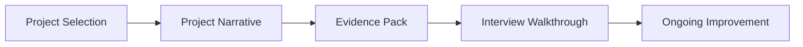

# Day 100 [Expert]: Portfolio and Interview Readiness

## Index

- [Goal](#goal)
- [Prerequisites](#prerequisites)
- [Explanation](#explanation)
- [Topic by Topic](#topic-by-topic)
- [Key Concepts](#key-concepts)
- [Visual Concept Map](#visual-concept-map)
- [End-to-End Practical](#end-to-end-practical)
- [Hands-on Coding](#hands-on-coding)
- [Mini Exercise](#mini-exercise)
- [Assessment Quiz](#assessment-quiz)
- [Task](#task)
- [Self Check](#self-check)
- [Interview Questions and Answers](#interview-questions-and-answers)
- [Day 100 Outcome](#day-100-outcome)

## Goal

Turn your React work into a portfolio-ready, interview-ready package that clearly shows problem solving, engineering quality, and growth.

## Prerequisites

- Day 99 completed
- At least one React capstone or mini project ready for polishing

## Explanation

Portfolio readiness is not only about having projects. It is about presenting the right evidence: what problem you solved, why your architecture is reasonable, what tradeoffs you made, and how you proved quality with testing, performance, accessibility, and maintainability.

## Topic by Topic

### Topic 1: Picking the Right Portfolio Projects

Theory:
Three strong projects are better than many unfinished or repetitive ones.

Practical:
Choose projects that show different strengths such as state management, data fetching, performance, and architecture.

Code Example:

```text
Project mix:
- CRUD product app
- Dashboard with routing and auth
- Capstone with performance and testing focus
```

**Explanation:** Portfolio readiness starts with choosing projects that show real depth, not just many similar CRUD apps.

**Key Points:**

- Pick projects that demonstrate different strengths.
- Prioritize quality over quantity.
- Choose work you can explain deeply.

### Topic 2: Writing a Strong Project Narrative

Theory:
Hiring reviewers need quick clarity on problem, approach, and result.

Practical:
Document each project using a simple structure: problem, solution, tradeoffs, impact.

Code Example:

```text
Problem: Users needed a fast searchable dashboard
Solution: React + TanStack Query + route-level code splitting
Tradeoff: Slightly higher setup complexity for better scalability
Impact: p95 page load reduced from 2.8s to 1.4s
```

**Explanation:** A strong project narrative helps interviewers understand the problem, your role, and the engineering decisions behind the solution.

**Key Points:**

- Explain the problem, approach, and tradeoffs clearly.
- Focus on what you personally designed or solved.
- Keep the story structured and concrete.

### Topic 3: Evidence that Builds Credibility

Theory:
Claims are weak without proof. Screenshots, metrics, tests, and architecture diagrams increase trust.

Practical:
Add one architecture diagram, one test snapshot, and one measurable improvement for each serious project.

Code Example:

```text
Evidence pack:
- architecture diagram
- Lighthouse or Web Vitals result
- test run screenshot
- deployment link or recorded demo
```

**Explanation:** Credibility comes from evidence such as metrics, architecture choices, testing, accessibility, and performance results.

**Key Points:**

- Back claims with measurable proof.
- Show before-and-after impact where possible.
- Use evidence to separate real work from vague claims.

### Topic 4: Interview Walkthrough Preparation

Theory:
Good projects can still perform badly in interviews if explanation is unstructured.

Practical:
Prepare both a short 3-minute summary and a deeper 10-minute walkthrough.

Code Example:

```text
Walkthrough order:
1) problem
2) architecture
3) tricky decisions
4) quality controls
5) lessons learned
```

**Explanation:** Interview walkthrough preparation matters because even strong projects lose value if you cannot explain them calmly and clearly.

**Key Points:**

- Practice how you demo and explain each project.
- Prepare for architecture and tradeoff questions.
- Keep the walkthrough focused on signal, not noise.

### Topic 5: Continuous Improvement After the Portfolio

Theory:
Portfolio quality improves over time through iteration, not one-time polishing.

Practical:
Review projects monthly and refresh README, demos, and metrics when skills improve.

Code Example:

```text
Monthly review checklist:
- update screenshots
- refresh metrics
- improve README clarity
- replace weaker project if a better one exists
```

**Explanation:** Continuous improvement keeps your portfolio relevant as your skills and standards grow over time.

**Key Points:**

- Revisit older projects with a critical eye.
- Upgrade weak areas like docs, tests, or accessibility.
- Keep your strongest work interview-ready.

### Topic 6: Portfolio-Level Excellence for Portfolio and Interview Readiness

Theory:
At expert level, outcomes improve when technical choices are backed by measurable impact, clear communication, and repeatable workflows.

Practical:
Capture one measurable outcome and one improvement plan linked to this topic so your portfolio evidence stays credible.

Code Example:

`jsx
// Track one measurable outcome and one follow-up improvement item.
`
**Explanation:** Portfolio-level excellence here means presenting your work as credible engineering evidence, not just a collection of demos.

**Key Points:**

- Show depth, clarity, and measurable quality.
- Connect projects to senior-level expectations.
- Treat the portfolio as part of your professional narrative.

## Key Concepts

- Portfolio project selection strategy
- Problem-solution-impact storytelling
- Evidence-based credibility building
- Structured interview walkthroughs
- Iterative project improvement

- Evidence-driven engineering

## Visual Concept Map



## End-to-End Practical

1. Pick 2 to 3 React projects worth showcasing.
2. Write README sections for problem, architecture, tradeoffs, and outcomes.
3. Add visual proof like screenshots, diagrams, and metrics.
4. Prepare a short and long verbal walkthrough.
5. Review and refine presentation quality.

## Hands-on Coding

### Example 1: Case - README Structure

Scenario:
Create a recruiter-friendly README for a capstone app.

```md
# Project Name

## Problem

## Solution

## Architecture Decisions

## Key Features

## Metrics and Quality Evidence

## Tradeoffs and Future Improvements
```

### Example 2: Case - Metrics Summary

Scenario:
Show concrete impact instead of generic claims.

```text
Before optimization:
- Bundle size: 410 KB
- p95 route load: 2.4s

After optimization:
- Bundle size: 255 KB
- p95 route load: 1.3s
```

### Example 3: Case - Demo Outline

Scenario:
Explain your React capstone clearly in an interview.

```text
1) What problem the app solves
2) Why you chose this architecture
3) How state and data fetching work
4) How reliability/accessibility/performance were handled
5) What you would improve next
```

## Mini Exercise

Scenario:
Prepare one portfolio-ready React project summary with README structure, architecture explanation, and one measurable outcome.

Expected output:

- Clear project narrative
- Evidence-backed quality claims
- Interview-friendly explanation flow

## Assessment Quiz

### Quiz Questions

1. Why are fewer stronger projects usually better than many weak ones?
2. What makes a portfolio claim believable?
3. True or False: Screenshots alone are enough to prove engineering quality.
4. Why should tradeoffs be included in a project explanation?
5. What should you improve if a project is technically strong but hard to explain?

### Quiz Answers

1. They show focus, quality, and better engineering depth.
2. Metrics, tests, architecture reasoning, and demo evidence.
3. False.
4. Tradeoffs show maturity and decision-making skill.
5. Its narrative, structure, and walkthrough clarity.

## Task

- Finalize one React portfolio project with README and evidence pack
- Prepare a short interview walkthrough
- Complete mini exercise and quiz

## Self Check

- You can present React work with clarity and credibility
- You can connect implementation choices to measurable outcomes
- You can answer at least 4 out of 5 quiz questions correctly

## Interview Questions and Answers

### Beginner

**Question:** What should be the first thing a portfolio project explains?

**Answer:** The problem it solves and why that problem matters.

### Middle

**Question:** How do you make a React project stand out to reviewers?

**Answer:** Show architecture decisions, measurable improvements, and production-minded quality controls.

### Advanced

**Question:** How do you present a tradeoff that led to some limitation in your project?

**Answer:** Explain the context, why the choice was reasonable then, what risk it reduced, and how you would evolve it later.

## Day 100 Outcome

- You can package React projects into a strong portfolio narrative
- You can explain your engineering decisions in interview-ready form
- You are ready to use the React track as proof of practical frontend depth
