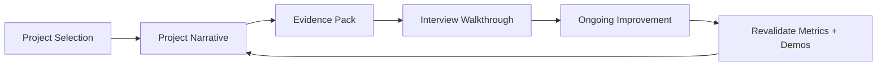

---
title: Portfolio and Interview Readiness
slug: day-100-portfolio-and-interview-readiness
dayLabel: Day 100
level: Expert
estimatedMinutes: 35
order: 100
track: react
---
# Day 100 [Expert]: Portfolio and Interview Readiness

## Goal

Turn your React work into a portfolio-ready, interview-ready package that clearly shows problem solving, engineering quality, and growth.

## Prerequisites

- Day 99 completed
- At least one React capstone or mini project ready for polishing

## Explanation

Portfolio readiness is not only about having projects. It is about presenting the right evidence: what problem you solved, why your architecture is reasonable, what tradeoffs you made, and how you proved quality with testing, performance, accessibility, and maintainability.

## Topic by Topic

### Topic 1: Picking the Right Portfolio Projects

Theory:
Three strong projects are better than many unfinished or repetitive ones.

Practical:
Choose projects that show different strengths such as state management, data fetching, performance, and architecture.

Code Example:

```text
Project mix:
- CRUD product app
- Dashboard with routing and auth
- Capstone with performance and testing focus
```

**Explanation:** Portfolio readiness starts with choosing projects that show real depth, not just many similar CRUD apps. Prefer projects where you can explain the problem, your personal contribution, technical decisions, and measurable outcome.

**Key Points:**

- Pick projects that demonstrate different strengths.
- Prioritize quality over quantity.
- Choose work you can explain deeply.
- Be explicit about your individual contribution in team projects.

### Topic 2: Writing a Strong Project Narrative

Theory:
Hiring reviewers need quick clarity on problem, approach, and result.

Practical:
Document each project using a simple structure: problem, solution, tradeoffs, impact.

Code Example:

```text
Problem: Users needed a fast searchable dashboard
Solution: React + TanStack Query + route-level code splitting
Tradeoff: Slightly higher setup complexity for better scalability
Impact: p95 page load reduced from 2.8s to 1.4s
```

**Explanation:** A strong project narrative helps interviewers understand the problem, your role, and the engineering decisions behind the solution. Keep metrics honest and reproducible; distinguish measured results from estimates.

**Key Points:**

- Explain the problem, approach, and tradeoffs clearly.
- Focus on what you personally designed or solved.
- Keep the story structured and concrete.
- Use reproducible metrics rather than unsupported claims.

### Topic 3: Evidence that Builds Credibility

Theory:
Claims are weak without proof. Screenshots, metrics, tests, and architecture diagrams increase trust.

Practical:
Add one architecture diagram, one test snapshot, and one measurable improvement for each serious project.

Code Example:

```text
Evidence pack:
- architecture diagram
- Lighthouse or Web Vitals result
- test run screenshot
- deployment link or recorded demo
```

**Explanation:** Credibility comes from evidence such as metrics, architecture choices, testing, accessibility, and performance results. Evidence should be easy to trace back to the project and should not expose secrets, credentials, private customer information, or proprietary code.

**Key Points:**

- Back claims with measurable proof.
- Show before-and-after impact where possible.
- Use evidence to separate real work from vague claims.
- Remove sensitive information before publishing evidence.

### Topic 4: Interview Walkthrough Preparation

Theory:
Good projects can still perform badly in interviews if explanation is unstructured.

Practical:
Prepare both a short 3-minute summary and a deeper 10-minute walkthrough.

Code Example:

```text
Walkthrough order:
1) problem
2) architecture
3) tricky decisions
4) quality controls
5) lessons learned
```

**Explanation:** Interview walkthrough preparation matters because even strong projects lose value if you cannot explain them calmly and clearly. Practice concise answers first, then prepare deeper details for follow-up questions.

**Key Points:**

- Practice how you demo and explain each project.
- Prepare for architecture and tradeoff questions.
- Keep the walkthrough focused on signal, not noise.
- Prepare a fallback explanation when the interviewer asks for deeper implementation details.

### Topic 5: Continuous Improvement After the Portfolio

Theory:
Portfolio quality improves over time through iteration, not one-time polishing.

Practical:
Review projects monthly and refresh README, demos, and metrics when skills improve.

Code Example:

```text
Monthly review checklist:
- update screenshots
- refresh metrics
- improve README clarity
- replace weaker project if a better one exists
```

**Explanation:** Continuous improvement keeps your portfolio relevant as your skills and standards grow over time. Use a simple review cycle to remove outdated claims, repair broken demos, and strengthen weak evidence.

**Key Points:**

- Revisit older projects with a critical eye.
- Upgrade weak areas like docs, tests, or accessibility.
- Keep your strongest work interview-ready.
- Remove broken links and outdated technology claims.

### Topic 6: Portfolio-Level Excellence for Portfolio and Interview Readiness

Theory:
At expert level, outcomes improve when technical choices are backed by measurable impact, clear communication, and repeatable workflows.

Practical:
Capture one measurable outcome and one improvement plan linked to this topic so your portfolio evidence stays credible.

Code Example:

```ts
// Track one measurable outcome and one follow-up improvement item.
const portfolioOutcome = {
  projectsReadyForInterview: 3,
  verifiedEvidenceItems: 9,
  nextReviewDate: "2026-09-01",
};
```

**Explanation:** Portfolio-level excellence here means presenting your work as credible engineering evidence, not just a collection of demos. Strong evidence describes the original problem, your contribution, the decision process, the measured result, and what you would improve next.

**Key Points:**

- Show depth, clarity, and measurable quality.
- Connect projects to senior-level expectations.
- Treat the portfolio as part of your professional narrative.
- Keep evidence truthful, reproducible, and safe to publish.

## Key Concepts

- Portfolio project selection strategy
- Problem-solution-impact storytelling
- Evidence-based credibility building
- Structured interview walkthroughs
- Iterative project improvement
- Evidence-driven engineering

## Visual Concept Map



## End-to-End Practical

1. Pick 2 to 3 React projects worth showcasing.
2. Write README sections for problem, architecture, tradeoffs, and outcomes.
3. Add visual proof like screenshots, diagrams, and metrics.
4. Prepare a short and long verbal walkthrough.
5. Review and refine presentation quality.
6. Verify that published evidence contains no secrets or private information.
7. Re-test important links and metrics before sharing the portfolio.

## Hands-on Coding

### Example 1: Case - README Structure

Scenario:
Create a recruiter-friendly README for a capstone app.

```md
# Project Name

## Problem

## Solution

## Architecture Decisions

## Key Features

## Metrics and Quality Evidence

## Tradeoffs and Future Improvements
```

**Review point:** Keep the README scannable. A reviewer should understand the project purpose, your contribution, architecture, and strongest evidence without reading the entire repository.

### Example 2: Case - Metrics Summary

Scenario:
Show concrete impact instead of generic claims.

```text
Before optimization:
- Bundle size: 410 KB
- p95 route load: 2.4s

After optimization:
- Bundle size: 255 KB
- p95 route load: 1.3s
```

**Review point:** State how each metric was measured and under what conditions. Avoid presenting synthetic or development-only numbers as production measurements.

### Example 3: Case - Demo Outline

Scenario:
Explain your React capstone clearly in an interview.

```text
1) What problem the app solves
2) Why you chose this architecture
3) How state and data fetching work
4) How reliability/accessibility/performance were handled
5) What you would improve next
```

**Review point:** Prepare one concrete example for each major architectural decision so follow-up questions can be answered from experience rather than memorized terminology.

## Mini Exercise

Scenario:
Prepare one portfolio-ready React project summary with README structure, architecture explanation, and one measurable outcome.

Expected output:

- Clear project narrative
- Evidence-backed quality claims
- Interview-friendly explanation flow
- Verified metrics and safe-to-publish evidence

## Assessment Quiz

### Quiz Questions

1. Why are fewer stronger projects usually better than many weak ones?
2. What makes a portfolio claim believable?
3. True or False: Screenshots alone are enough to prove engineering quality.
4. Why should tradeoffs be included in a project explanation?
5. What should you improve if a project is technically strong but hard to explain?
6. Why should portfolio metrics be reproducible?
7. What should you check before publishing screenshots or repository evidence?
8. Why is explicitly describing your personal contribution important in team projects?

### Quiz Answers

1. They show focus, quality, and better engineering depth.
2. Metrics, tests, architecture reasoning, and demo evidence.
3. False.
4. Tradeoffs show maturity and decision-making skill.
5. Its narrative, structure, and walkthrough clarity.
6. Reproducible measurements make claims credible and easier to validate.
7. Remove secrets, credentials, private data, and proprietary information.
8. It lets reviewers distinguish your actual engineering contribution from the team's overall output.

## Task

- Finalize one React portfolio project with README and evidence pack.
- Prepare a short interview walkthrough.
- Verify published metrics and links.
- Complete mini exercise and quiz.
- Record one improvement area for the next portfolio review.

## Self Check

- You can present React work with clarity and credibility.
- You can connect implementation choices to measurable outcomes.
- You can verify evidence before publishing it.
- You can answer at least 6 out of 8 quiz questions correctly.

## Interview Questions and Answers

### Beginner

**Question:** What should be the first thing a portfolio project explains?

**Answer:** The problem it solves and why that problem matters.

### Middle

**Question:** How do you make a React project stand out to reviewers?

**Answer:** Show architecture decisions, measurable improvements, and production-minded quality controls.

### Advanced

**Question:** How do you present a tradeoff that led to some limitation in your project?

**Answer:** Explain the context, why the choice was reasonable then, what risk it reduced, and how you would evolve it later.

**Question:** How should you present metrics in an interview?

**Answer:** Explain what was measured, how it was measured, the baseline, the change, and any important conditions or limitations. Do not exaggerate estimated results as production facts.

**Question:** How would you prepare a portfolio for a senior React role?

**Answer:** Select a small set of technically diverse projects, document architecture and tradeoffs, demonstrate testing/accessibility/performance, show measurable outcomes, clearly state personal contributions, and rehearse concise and deep walkthroughs.

## Day 100 Outcome

- You can package React projects into a strong portfolio narrative
- You can explain your engineering decisions in interview-ready form
- You can support technical claims with credible evidence and measurable outcomes
- You are ready to use the React track as proof of practical frontend depth
